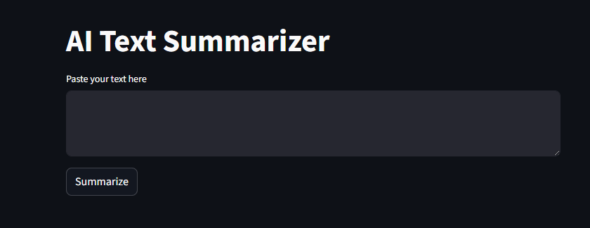
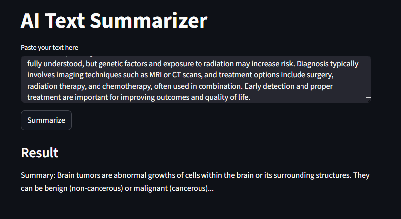

# AI Text Summarizer

A simple and beginner-friendly AI-powered text summarizer built with **Python** and **Streamlit**.  
This project provides a clean web interface where users can paste text and generate a short summary instantly.

It is designed as a starter project for learning how to:

- build a Python app
- separate UI and logic cleanly
- use Streamlit for web interfaces
- manage a project with Git and GitHub
- prepare an AI app for deployment

---

## Project Overview

The **AI Text Summarizer** is a lightweight text summarization application.  
Users can enter or paste text into the app, click a button, and receive a simplified summarized output.

This project is intentionally kept simple so it can serve as a strong foundation for learning AI application development and deployment.

---

## Features

- Clean and simple user interface
- Paste text directly into the app
- Generate a short summary instantly
- Built with beginner-friendly Python code
- Organized project structure
- Ready to be expanded with real AI/LLM integration later
- Suitable for GitHub portfolio projects

---
## Screenshots

### Main Interface


### Summary Result



---

## Tech Stack

This project uses the following technologies:

- **Python** — core programming language
- **Streamlit** — for building the web app interface
- **Git** — version control
- **GitHub** — repository hosting and project publishing

---

## Project Structure

```text
ai-text-summarizer/
├── assets/
│   └── screenshots/
│       ├── main-interface.png
│       └── generated-summary.png
├── .venv/
├── __pycache__/
├── .env
├── .gitignore
├── ai_service.py
├── app.py
├── README.md
└── requirements.txt